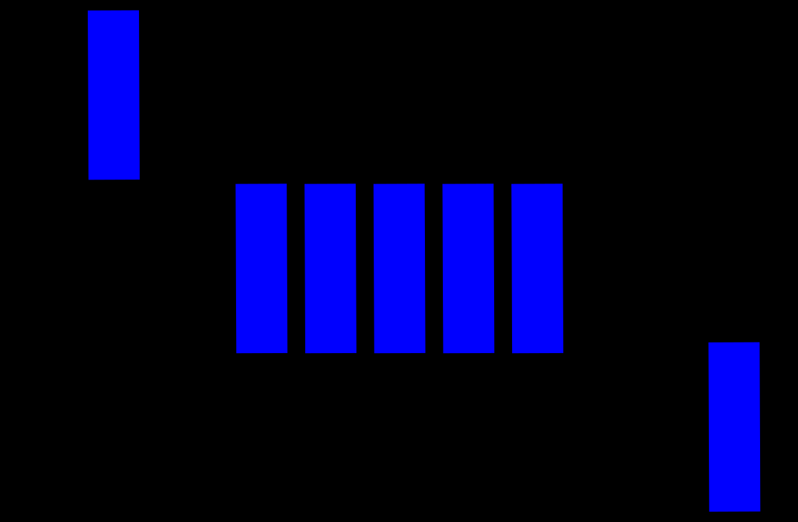

# OOPs_Concepts
Learn about OOPs and DSA concepts from scratch

### What is Queue?
. Queue is a linear data structure
. Working principle of queue is FIFO (First In First Out)
. Its an abstract data structure
. It has two phases:
    - Rear ==> Insertion
    - Front ==> Deletion

### Operatins on Queue is:
. Enqueue ==> Insert
. Dequeue ==> Delete
. is_empty
. get_front
. get_rear
. size

### Real world examples are:
. Queue for roller coaster ride in amusement park
. Shuttle cock (Badminton) is a cylindrical box
. Breadth first Search(Graph)

### Implementation of Queue is:
1. Using List
2. By extending list class
3. using single listed class
4. By extending linked list class
5. Using linked list concept